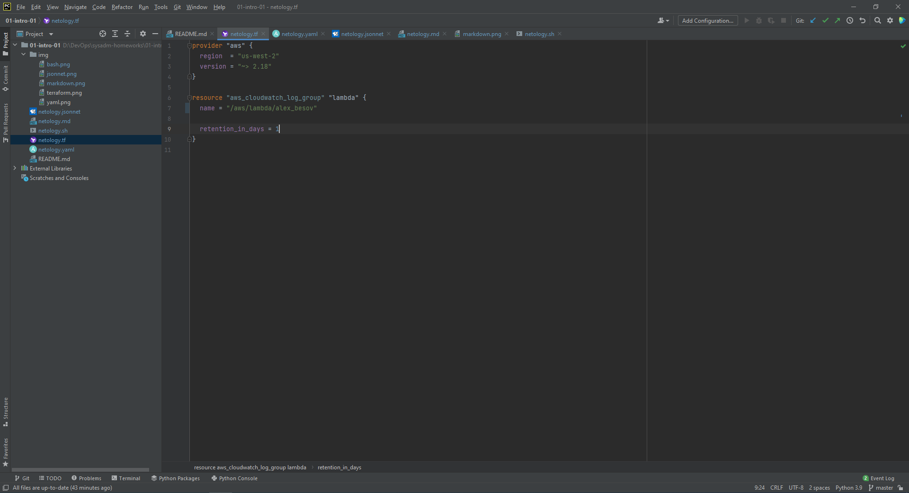
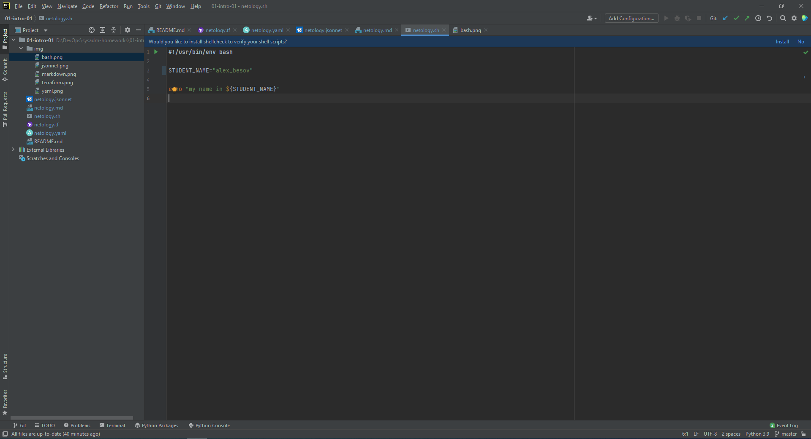
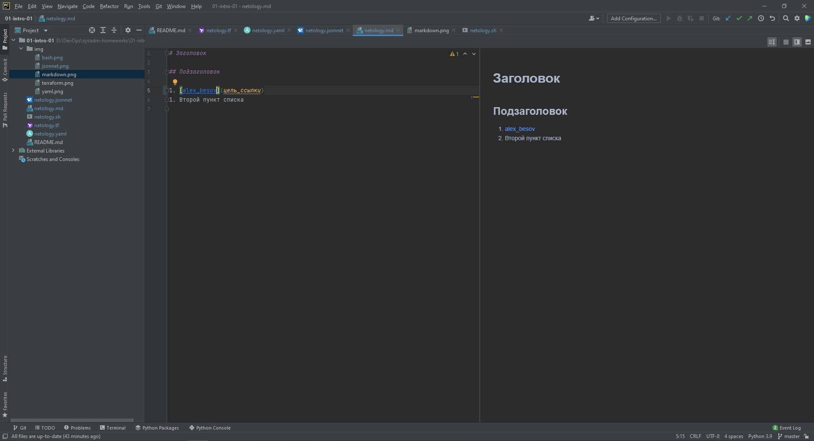
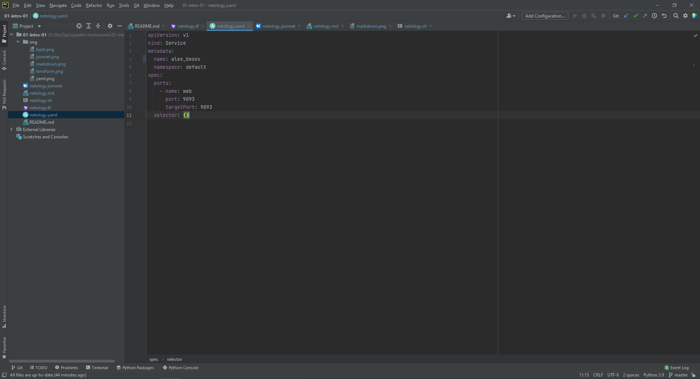
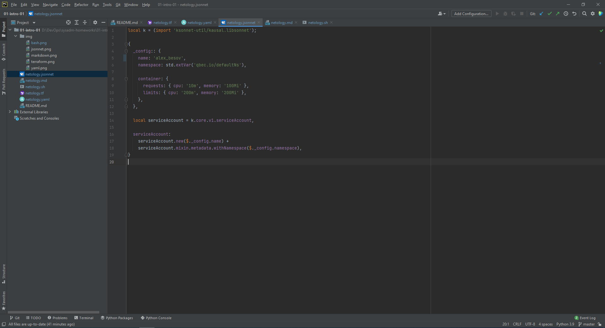
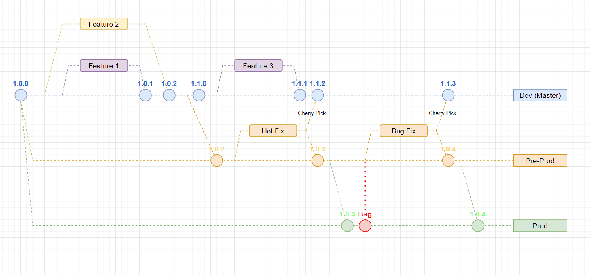

# Домашнее задание к занятию «1.1. Введение в DevOps»

## Задание №1 - Подготовка рабочей среды

1. Установка плагинов и проверка подсветки синтаксиса:
    - Terraform: 
 
Скриншот:
  

    - Bash: 
 
Скриншот:
 

    - Markdown: 
 
Скриншот:
  

    - Yaml: 
 
Скриншот:
  

    - Jsonnet:
 
Скриншот:
  

    
## Задание №2 - Описание жизненного цикла задачи (разработки нового функционала)

### Описание истории

Представьте, что вы работаете в стартапе, который запустил интернет-магазин. Ваш интернет-магазин достаточно успешно развивался, и вот пришло время налаживать процессы: у вас стало больше конечных клиентов, менеджеров и разработчиков.Сейчас от клиентов вам приходят задачи, связанные с разработкой нового функционала. Задач много, и все они требуют выкладки на тестовые среды, одобрения тестировщика, проверки менеджером перед показом клиенту. В случае необходимости, вам будет необходим откат изменений. Вам необходимо описать процесс решения задачи в соответствии с жизненным циклом разработки программного обеспечения. Использование какого-либо конкретного метода разработки необязательно. Для решения главное - прописать по пунктам шаги решения задачи (релизации в конечный результат) с участием менеджера, разработчика (или команды разработчиков), тестировщика (или команды тестировщиков) и себя как DevOps-инженера. 

### Решение задачи

1. Задача поступившая от клиента поступает по электронной почте, по форме общения с клиентами или на личных встречах с клиентом. Обсуждается возможность реализации нового функционала и сроки реализации.
2. Менеджером составляется список фич которые должный быть реализованы в данной версии ПО (например в версии 1.0).
3. Менеджер в программе для управления проектами (Jira, Redmine и т.п.) создаются задачи для программистов с указанием приоритета задачи и сроков ее выполнения и назначает ответственного за реализацию разработчика.
4. Программист принимает задачу и создает из текущей ветки разработки (dev) свою (feature branch) с указанием номера задачи для реализации нового функционала. 
5. Пишется код и юнит тесты и проверяется корректность работы реализуемого функционала, запуск юнит теста добавляется в файл автосборки проекта. Как систему управления репозиторием выберем GitLab.
Как методологию разработки будем использовать GitLab flow где dev веткой является master.
- Пример ветвления проекта:
 
Скриншот:
  

6. После написания кода и тестов проект заливается в репозиторий, где инициализируется автосборка проекта, запуск юнит тестов и анализатора кода (например PVS-Studio), о результатах прохождения тестов разработчик информируется e-mail сообщением с логами выполнения, также эту информацию можно будет узнать через веб-интерфейс GitLab.
7. После успешного прохождения тестов инициализируется сборка готовой песочницей, где разработчик может посмотреть корректность работы приложения.
8. Далее программист создает merge request адресованный другому разработчику который оценит результат работы (грамотность реализации, наличие комментариев, соблюдение code style и читаемость кода) и разрешит или запретит слияние с основной веткой разработки.
9. После слияния также инициализируется сборка проекта со всеми тестами и песочницей как в feature branch, сама ветка фичи убирается, также ветке присваивается новая семантическая версия (увеличивается номер патча), задача в программе для управления проектами закрывается, добавляется мониторинг. В случае возникновения нештатных ситуаций информируется ведущий разработчик, DevOps инженер, человек одобривший слияние и сам разработчик. Доступ к ветке разработки имеет также менеджер проекта.
10. После реализации запланированных фич и согласования с заказчиков и менеджером запускается предрелизная подготовка. Отправкой версии в pre-prod ветку занимается сам Dev Ops инженер или автоматизирует отправку по таймеру дедлайна. В пайплайн сборки добавляются также интеграциооные тесты и нагрузочные тесты. При успешном прохождении ветка dev увеличивается на минорную или мажорную версию, при провале идет анализ того что пошло не так с информированием ведущего разработчика, DevOps инженера и менеджера. В предрелизную ветку вносятся только правки ошибок никакие новые функции не добавляются, в ней же идет тестирование функционала и предоставление доступа клиенту для тестирования и ознакомления, любые измения вносятся через отдельную ветку с последующим merge request-ом pre-prod ветку и частичный (cherry-pick) в dev ветку если это необходимо.
11. Когда принято решение, что все готово обновляется prod ветка (при необходимости можно держать несколько релизных веток различных версий). Новая версия выкладывается в общий доступ на сайте (реализация доставки обязанность DevOps инженера).
12. При обнаружении бага в релизной версии никакие изменения на прямую в prod ветку не вносятся, для этого создается бранч в pre-prod ветке для применения хотфикса. 

Кратко в обязанности DevOps инженера входит организация инфраструктуры, рабочего процесса CI/CD и поддержание их работоспособности, мониториг инфаструктуры. Написание конфигурационных файлов райплайнов, конфигов мониторинга, а также скриптов автоматизации. Интеграция новых сервисов и обновление существующих. Подбор оптимальной конфигурации железа для работы проекта.